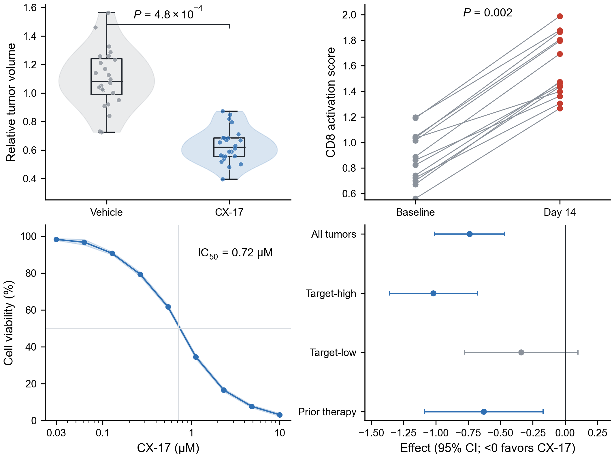
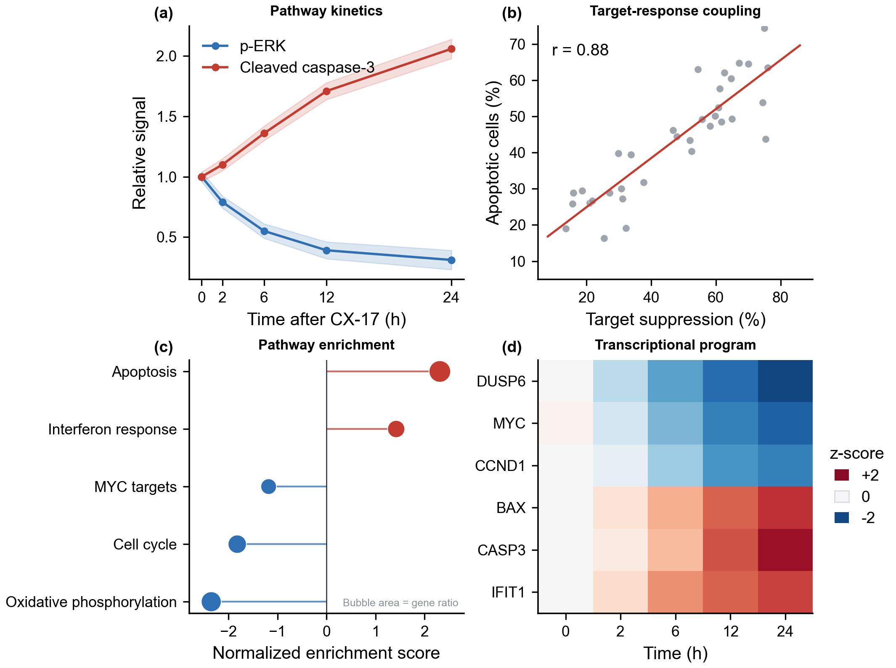

# polish-sci-figures

A reusable Codex skill for creating, redrawing, arranging, auditing, and
delivering publication-grade scientific figures.

用于 SCI 论文图片、科研绘图、可编辑 SVG、论文组图和多面板图片质量检查的 Codex Skill。

## Preview

Publication-ready examples spanning efficacy, mechanism, validation,
single-cell and spatial analysis, systems biology, and interpretable modeling.
All values are deterministic synthetic demonstration data.

### Efficacy



### Mechanism



### Validation


### Single-cell and spatial atlas


### Systems biology


### Interpretable modeling


## Highlights

- Strict mathematical alignment for multi-panel labels.
- Publication-oriented typography, spacing, color semantics, and export sizes.
- Scientifically appropriate plot selection instead of repetitive bar charts.
- Original-versus-redesign A/B selection at the same final size.
- Exact italic *P* formatting and final-size readability checks.
- Editable SVG/PDF plus 300-600 dpi PNG delivery.
- Fixed physical canvas profiles so equal font sizes stay equal after assembly.
- SVG canvas, continuous-text, raster/editability, and post-insertion checks.
- PyMuPDF rendering with an automatic Poppler `pdftoppm` fallback.

## Install

Clone or download this repository, then copy only the skill folder.

### Windows PowerShell

```powershell
New-Item -ItemType Directory -Force "$HOME\.codex\skills" | Out-Null
Copy-Item -Recurse -Force ".\skills\polish-sci-figures" "$HOME\.codex\skills\"
```

### macOS / Linux

```bash
mkdir -p ~/.codex/skills
cp -R skills/polish-sci-figures ~/.codex/skills/
```

Start a new Codex session after installation.

Install the core Python dependencies:

```bash
python -m pip install -r requirements.txt
```

For PDF rendering without Poppler, optionally install PyMuPDF:

```bash
python -m pip install pymupdf
```

## Use

Example requests:

```text
Use $polish-sci-figures to turn these result plots into a journal-ready 2×2 figure.
Use $polish-sci-figures to audit this SVG/PDF figure before submission.
Use $polish-sci-figures to export these slide panels on one fixed canvas profile.
用 $polish-sci-figures 把这些结果图统一成可投稿的多面板主图。
```

The skill should always follow the current project's data, journal, manuscript,
and visual conventions over its defaults.

## Reproduce the demo

Install the skill first, then run:

```bash
python demo/figure_sources/make_demo_suite.py
```

The script writes PNG, SVG, and PDF files to `demo/final_figures/`. It uses
synthetic data and runs the bundled panel-label alignment audit before export.

Verify that all six demo figures share one physical canvas:

```bash
python skills/polish-sci-figures/scripts/check_svg_canvas.py demo/final_figures/*.svg
```

## Repository layout

```text
skills/polish-sci-figures/   installable skill package
demo/                        preview images and reproducible source
requirements.txt             core Python dependencies
```

## License

MIT License. See [LICENSE](LICENSE).
