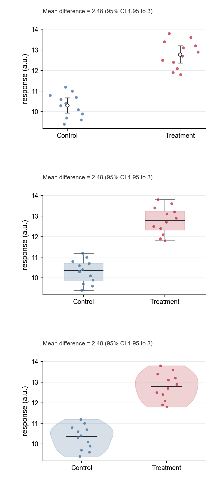
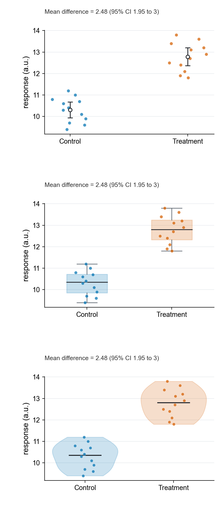

# SCI Figure Skills

An original, runnable Codex skill suite for turning raw research data and scientific images into publication-ready figures, then auditing the final artwork.

中文简介：从原始表格自动生成多种可靠的 SCI 图候选并一键换色；批量统一显微、荧光、电镜等科研图片的尺寸、显示参数和规范标尺；最后完成可编辑 SVG、固定画布、字体、留白、重叠与组图质控。

## Three-skill pipeline

| Skill | What it does | Main outputs |
| --- | --- | --- |
| `make-sci-data-figures` | Profiles CSV/TSV/XLSX data, records the experimental design, chooses defensible statistics, and creates several chart candidates from the same data | PNG/SVG/PDF candidates, gallery, analysis plan, reproducible recipe |
| `standardize-sci-images` | Non-destructively standardizes microscopy, fluorescence, histology, and electron-microscopy images | Equal-size panels, calibrated scale bars, montage, SHA-256 processing audit |
| `polish-sci-figures` | Redraws, assembles, and audits final manuscript, slide, poster, or showcase figures | Fixed-canvas editable files and final-size QA |

These are not renamed copies of third-party skills. The workflow and code were written for this repository around recurring real-world pain points: wrong statistical units, hidden distributions, inconsistent palettes, unequal canvases, changing apparent font sizes, internal mini-titles, panel numbers, overlaps, broken scientific notation, uneditable SVG text, guessed scale bars, and unfair per-image contrast tuning.

## Raw data to figure candidates

The bundled example is deterministic synthetic demonstration data.

Top to bottom: raw observations with estimate and 95% CI, box plot with raw observations, and violin plot with raw observations. The descriptions stay outside the reusable artwork.



```bash
python skills/make-sci-data-figures/scripts/figure_workbench.py generate \
  skills/make-sci-data-figures/examples/synthetic_group_comparison.csv \
  --group condition --value response --unit sample_id \
  --design independent --outcome-type continuous \
  --order Control,Treatment --unit-label "a.u." --palette zhoy_muted \
  --outdir demo/workbench
```

Change only the palette while keeping the data, statistics, order, labels, axes, and canvas unchanged:

```bash
python skills/make-sci-data-figures/scripts/figure_workbench.py recolor \
  demo/workbench/figure_recipe.json --palette okabe_ito \
  --outdir demo/workbench_okabe_ito
```



The workbench intentionally covers common independent and paired group comparisons. It reports limitations instead of pretending to automate mixed models, survival analysis, compositional data, high-dimensional omics, or other specialist designs.

## Scientific image standardization

The preview below uses synthetic fluorescence-like software-test images, not biological observations.


```bash
python skills/standardize-sci-images/scripts/make_example_data.py \
  --outdir demo/image_inputs

python skills/standardize-sci-images/scripts/standardize_images.py \
  demo/image_inputs/manifest.csv --scale-bar-um 20 \
  --outdir demo/image_standardization
```

The image workflow never overwrites raw files, never invents calibration, never tunes display settings per comparison image, and never resamples by default. It records source hashes, crop boxes, display parameters, calibration, and scale-bar geometry. Each panel includes an unannotated display raster, a review preview, and an SVG with the scale bar/text kept as editable vector/live layers.

## Figure-polishing showcase

All values in these previews are deterministic synthetic demonstration data.


## Shared quality rules

- No panel letters, serial labels, internal titles, or subtitles unless the verified target explicitly requires them.
- Arial by default, with one-place switching to Times New Roman or another verified journal font.
- Correct scientific case, italics, symbols, units, subscripts, and superscripts.
- Zero unintended overlap at final placement.
- Equal physical canvases and axes geometry for panels that will be assembled together; no tight-crop export.
- Editable SVG/PDF plus high-resolution PNG, with live continuous text.
- Stable group order, color meaning, uncertainty definition, and statistical scope.
- Raw scientific data and images remain authoritative; examples stay clearly labeled synthetic.

## Install

Clone or download the repository, install dependencies, then copy all three skill folders.

### Windows PowerShell

```powershell
python -m pip install -r requirements.txt
New-Item -ItemType Directory -Force "$HOME\.codex\skills" | Out-Null
Copy-Item -Recurse -Force ".\skills\make-sci-data-figures" "$HOME\.codex\skills\"
Copy-Item -Recurse -Force ".\skills\standardize-sci-images" "$HOME\.codex\skills\"
Copy-Item -Recurse -Force ".\skills\polish-sci-figures" "$HOME\.codex\skills\"
```

### macOS / Linux

```bash
python -m pip install -r requirements.txt
mkdir -p ~/.codex/skills
cp -R skills/make-sci-data-figures ~/.codex/skills/
cp -R skills/standardize-sci-images ~/.codex/skills/
cp -R skills/polish-sci-figures ~/.codex/skills/
```

Start a new Codex session after installation.

## Call the skills

```text
Use $make-sci-data-figures to profile this table and make several publication-ready candidates.
Use $make-sci-data-figures to rerender the selected figure with the okabe_ito palette only.
Use $standardize-sci-images to standardize this microscopy batch and add calibrated 20 µm scale bars.
Use $polish-sci-figures to assemble the chosen panels and audit the final editable SVGs.
```

## Verify the repository

```bash
python skills/make-sci-data-figures/scripts/test_figure_workbench.py
python skills/standardize-sci-images/scripts/test_standardize_images.py
python -m compileall -q demo skills
```

For a set of independently editable SVG panels intended for the same slot:

```bash
python skills/polish-sci-figures/scripts/check_svg_canvas.py path/to/panels/*.svg
python skills/polish-sci-figures/scripts/check_svg_editability.py --require-fully-editable path/to/panels/*.svg
```

## Repository layout

```text
skills/make-sci-data-figures/   raw data, statistics, candidate charts, palette recipes
skills/standardize-sci-images/  calibrated image standardization and processing audit
skills/polish-sci-figures/      final drawing, assembly, export, and QA
demo/                           reproducible synthetic previews
requirements.txt                Python dependencies
```

## License

MIT License. See [LICENSE](LICENSE).
