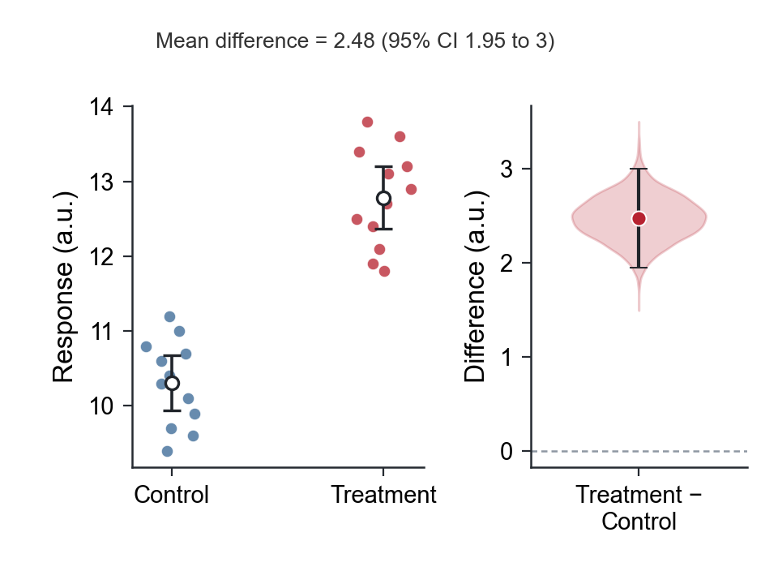
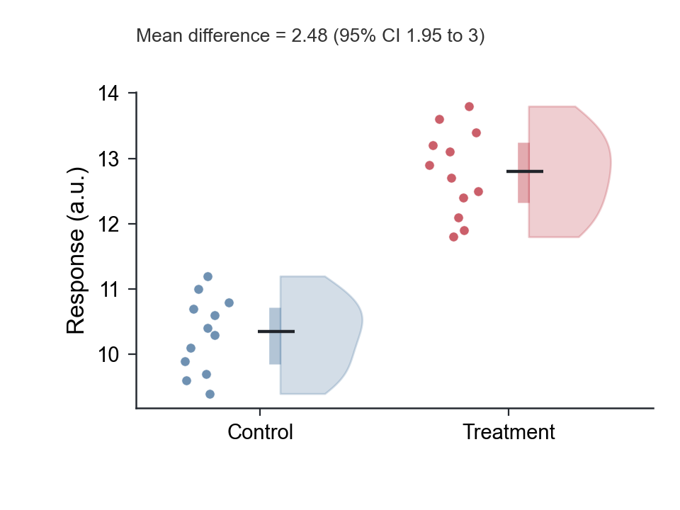
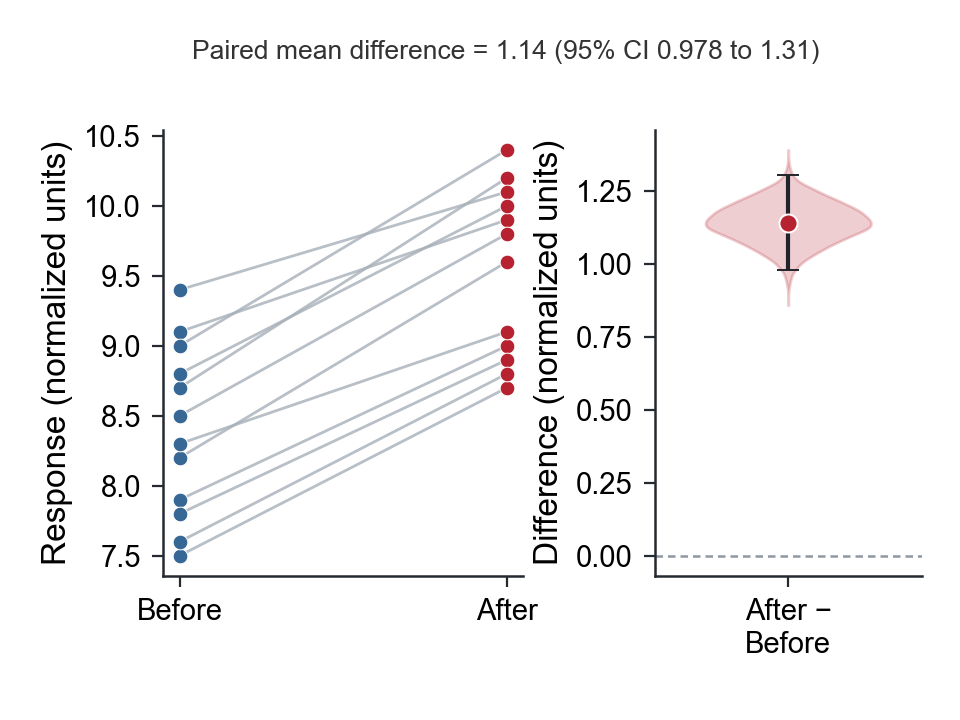
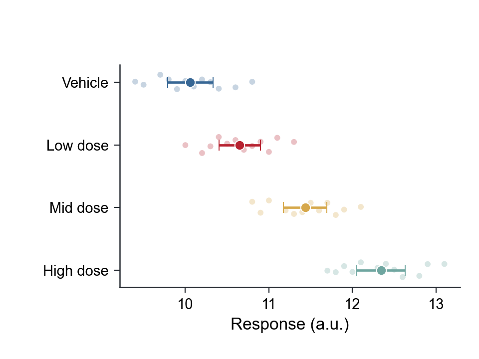
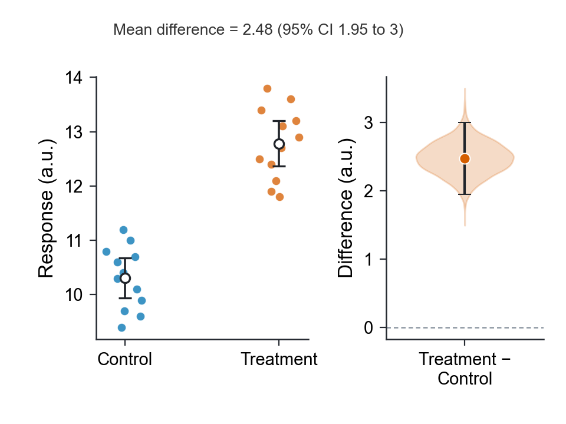

# SCI Figure Skills

Publication-grade scientific visualization for raw data, microscopy, multimodal analysis, and multi-panel figure assembly.

中文简介：从原始表格自动生成多种可靠的 SCI 图候选并一键换色；批量统一显微、荧光、电镜等科研图片的尺寸、显示参数和规范标尺；最后完成可编辑 SVG、固定画布、字体、留白、重叠与组图质控。

## Advanced reproducible figures

Deterministic synthetic datasets, fixed random seeds, source-controlled rendering, and matched 180.34 × 134.62 mm PNG/SVG/PDF exports.

### Longitudinal multimodal ecosystem

Conserved cell-state flows, directional ligand–receptor interactions, RNA–ATAC concordance, and treatment-response distributions in one coordinated figure.


### Single-cell and spatial atlas

Bent single-cell manifolds, pseudotime branching, spatial domains with a declared synthetic scale, and marker-expression dot plots.


### Systems biology integration

Directional cell communication, cross-platform pathway activity, causal mediation, and response-surface optimization.


### Interpretable and externally validated modeling

Feature contributions, calibration, decision-curve analysis, and repeated external validation.


### Reproduce

```bash
python -m pip install -r requirements.txt
python demo/figure_sources/make_demo_suite.py
```

## Three-skill pipeline

| Skill | What it does | Main outputs |
| --- | --- | --- |
| `make-sci-data-figures` | Profiles CSV/TSV/XLSX data, records the experimental design, chooses defensible statistics, and creates several chart candidates from the same data | PNG/SVG/PDF candidates, gallery, analysis plan, reproducible recipe |
| `standardize-sci-images` | Non-destructively standardizes microscopy, fluorescence, histology, and electron-microscopy images | Equal-size panels, calibrated scale bars, montage, SHA-256 processing audit |
| `polish-sci-figures` | Redraws, assembles, and audits final manuscript, slide, poster, or showcase figures | Fixed-canvas editable files and final-size QA |

The suite enforces experimental-unit integrity, stable palette semantics, equal physical canvases, live SVG text, scientific notation, and final-size collision and whitespace QA.

## Raw data to figures and statistics

Input: tidy CSV, TSV, or XLSX with group, outcome, biological experimental-unit ID, and design. Output: design-matched statistics, multiple figure forms, editable masters, and a machine-readable analysis plan.

- **Candidate selection:** estimation graphics, rainclouds, paired estimation graphics, group-estimate intervals, raw-data summaries, box plots, and violins selected by design and sample size.
- **Design-aware inference:** experimental unit and pairing determine the estimand, confidence interval, primary test, and sensitivity analysis.
- **Palette-only rendering:** color changes preserve data, statistics, axes, ordering, labels, and geometry.
- **Production geometry:** identical physical canvases, Arial typography, live SVG text, and editable PDF/SVG output.
- **Scope control:** repeated-measures models, survival analysis, count models, compositional data, and high-dimensional omics are flagged for domain-specific analysis.

Demonstration datasets in this section are deterministic and synthetic.

### Estimation-first two-group comparison

Raw observations, group estimates, and the bootstrap distribution of the treatment-minus-control effect: mean difference 2.48 a.u. (95% CI 1.95 to 3.00).



### Raincloud distribution view

Half-violin density, individual observations, interquartile range, and median. Density views require at least 10 observations per group.



### Paired estimation view

Subject-level trajectories with paired mean difference 1.14 normalized units (95% CI 0.978 to 1.31).



### Multi-group effect intervals

Biological-unit observations, group means, and 95% CIs. Global inference remains separate from pairwise contrasts.



Scientific basis: estimation-first reporting in [Ho et al., *Nature Methods* (2019)](https://www.nature.com/articles/s41592-019-0470-3), [raincloud plots](https://pmc.ncbi.nlm.nih.gov/articles/PMC6480976/), and the [Nature Research figure guide](https://research-figure-guide.nature.com/figures/preparing-figures-our-specifications/).

## Statistical design matching

| Design | Minimum declaration | Analysis | Validation |
| --- | --- | --- | --- |
| Control vs treatment using different biological samples | `condition`, `Response`, `sample_id`, `independent` | Treatment-minus-control mean difference and 95% CI; Welch two-sample test; Mann-Whitney sensitivity analysis. Example effect: 2.48 a.u. (1.95 to 3.00). | Repeated unit IDs are rejected instead of being counted as independent replication. |
| Before vs after on the same subjects | `condition`, `Response`, `subject_id`, `paired` | Within-subject mean difference and 95% CI; paired test; Wilcoxon sensitivity analysis. Example change: 1.14 normalized units (0.978 to 1.31). | Duplicate subject-condition rows are rejected; incomplete pairs are counted and reported. |
| Vehicle plus three independent dose groups | `condition`, `Response`, `sample_id`, `independent` | Group means and 95% CIs; global Welch ANOVA; Kruskal-Wallis sensitivity analysis. | Global inference reported separately from pairwise contrasts; multiplicity status explicit. |

Exact tests, effect direction, sample counts, exclusions, diagnostics, limitations, analysis scope, and multiplicity status are written to `analysis_plan.json`. Exploratory results show the effect and interval on the artwork while keeping *P* values in the analysis record; `--scope confirmatory --show-p-value` is available only after a pre-specified confirmatory family is declared.

### Reproducible examples

```bash
# Independent two-group comparison: creates five candidates
python skills/make-sci-data-figures/scripts/figure_workbench.py generate \
  skills/make-sci-data-figures/examples/synthetic_group_comparison.csv \
  --group condition --value Response --unit sample_id \
  --design independent --order Control,Treatment --unit-label "a.u." \
  --outdir demo/workbench

# Paired before/after comparison: creates paired effect and trajectory views
python skills/make-sci-data-figures/scripts/figure_workbench.py generate \
  skills/make-sci-data-figures/examples/synthetic_paired_response.csv \
  --group condition --value Response --unit subject_id \
  --design paired --order Before,After --unit-label "normalized units" \
  --outdir demo/paired_workbench

# Four independent groups: creates group-interval and distribution views
python skills/make-sci-data-figures/scripts/figure_workbench.py generate \
  skills/make-sci-data-figures/examples/synthetic_multigroup_response.csv \
  --group condition --value Response --unit sample_id --design independent \
  --order "Vehicle,Low dose,Mid dose,High dose" --unit-label "a.u." \
  --outdir demo/multigroup_workbench
```

Palette-only render:

```bash
python skills/make-sci-data-figures/scripts/figure_workbench.py recolor \
  demo/workbench/figure_recipe.json --palette okabe_ito \
  --outdir demo/workbench_okabe_ito
```



Supported inferential scope: common continuous-outcome independent and paired group comparisons. Specialist designs are flagged for domain-specific analysis.

## Scientific image standardization

Demonstration asset: deterministic synthetic fluorescence imagery.


```bash
python skills/standardize-sci-images/scripts/make_example_data.py \
  --outdir demo/image_inputs

python skills/standardize-sci-images/scripts/standardize_images.py \
  demo/image_inputs/manifest.csv --scale-bar-um 20 \
  --outdir demo/image_standardization
```

Processing is non-destructive and batch-consistent. The audit records source hashes, crop boxes, display parameters, calibration, and scale-bar geometry. Scale bars require explicit calibration. Outputs include an unannotated raster, review preview, and SVG with editable scale-bar and text layers.

## Additional reproducible manuscript examples

Deterministic synthetic manuscript examples:


## Shared quality rules

- No panel letters, serial labels, internal titles, or subtitles unless the verified target explicitly requires them.
- Arial by default, with one-place switching to Times New Roman or another verified journal font.
- Correct scientific case, italics, symbols, units, subscripts, and superscripts.
- Zero unintended overlap at final placement.
- Equal physical canvases and axes geometry for panels that will be assembled together; no tight-crop export.
- Editable SVG/PDF plus high-resolution PNG, with live continuous text.
- Stable group order, color meaning, uncertainty definition, and statistical scope.
- Raw scientific data and images remain authoritative; examples stay clearly labeled synthetic.

## Install

Clone or download the repository, install dependencies, then copy all three skill folders.

### Windows PowerShell

```powershell
python -m pip install -r requirements.txt
New-Item -ItemType Directory -Force "$HOME\.codex\skills" | Out-Null
Copy-Item -Recurse -Force ".\skills\make-sci-data-figures" "$HOME\.codex\skills\"
Copy-Item -Recurse -Force ".\skills\standardize-sci-images" "$HOME\.codex\skills\"
Copy-Item -Recurse -Force ".\skills\polish-sci-figures" "$HOME\.codex\skills\"
```

### macOS / Linux

```bash
python -m pip install -r requirements.txt
mkdir -p ~/.codex/skills
cp -R skills/make-sci-data-figures ~/.codex/skills/
cp -R skills/standardize-sci-images ~/.codex/skills/
cp -R skills/polish-sci-figures ~/.codex/skills/
```

Start a new Codex session after installation.

## Call the skills

```text
Use $make-sci-data-figures to profile this table and make several publication-ready candidates.
Use $make-sci-data-figures to rerender the selected figure with the okabe_ito palette only.
Use $standardize-sci-images to standardize this microscopy batch and add calibrated 20 µm scale bars.
Use $polish-sci-figures to assemble the chosen panels and audit the final editable SVGs.
```

## Verify the repository

```bash
python skills/make-sci-data-figures/scripts/test_figure_workbench.py
python skills/standardize-sci-images/scripts/test_standardize_images.py
python -m compileall -q demo skills
```

For a set of independently editable SVG panels intended for the same slot:

```bash
python skills/polish-sci-figures/scripts/check_svg_canvas.py path/to/panels/*.svg
python skills/polish-sci-figures/scripts/check_svg_editability.py --require-fully-editable path/to/panels/*.svg
```

## Repository layout

```text
skills/make-sci-data-figures/   raw data, statistics, candidate charts, palette recipes
skills/standardize-sci-images/  calibrated image standardization and processing audit
skills/polish-sci-figures/      final drawing, assembly, export, and QA
demo/                           reproducible synthetic previews
requirements.txt                Python dependencies
```

## License

MIT License. See [LICENSE](LICENSE).
