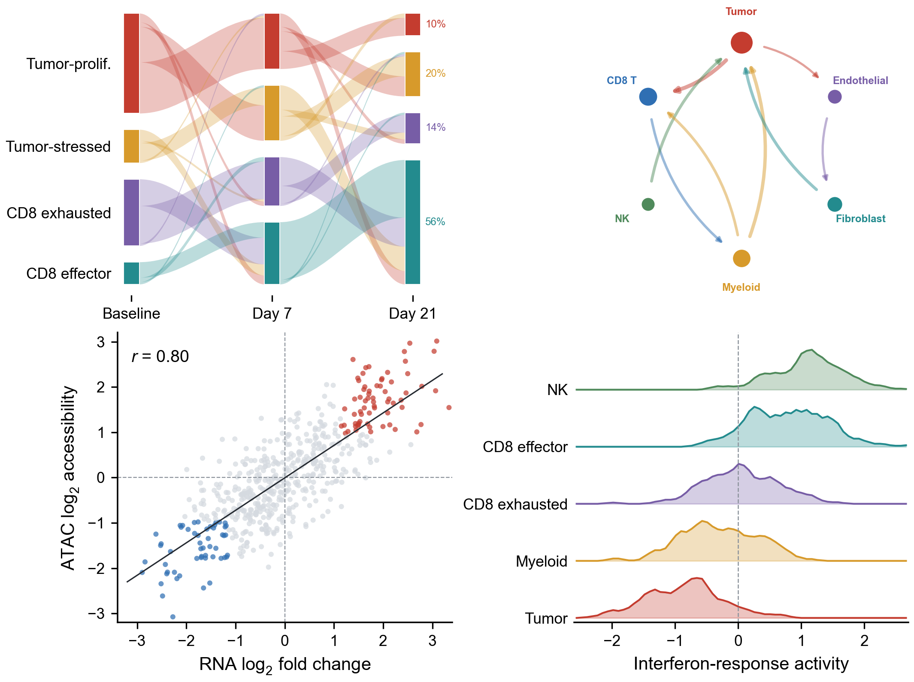
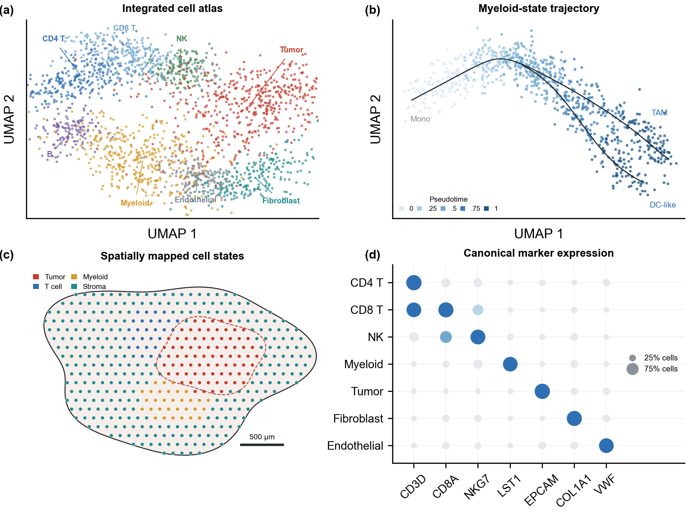
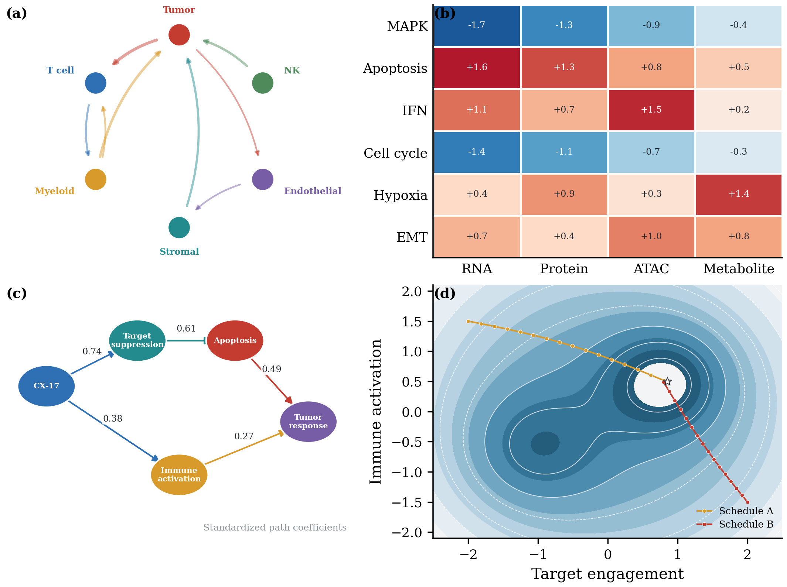
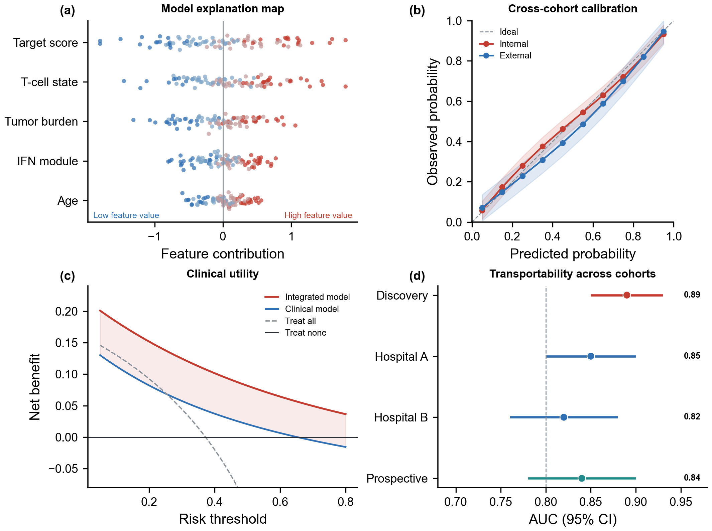
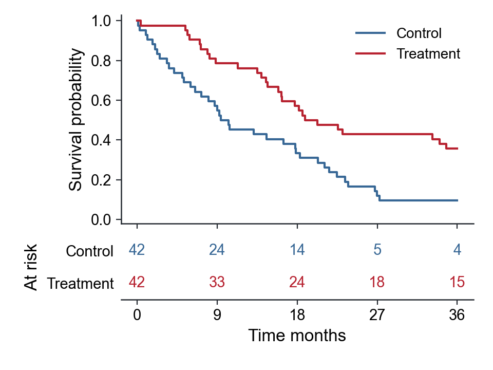
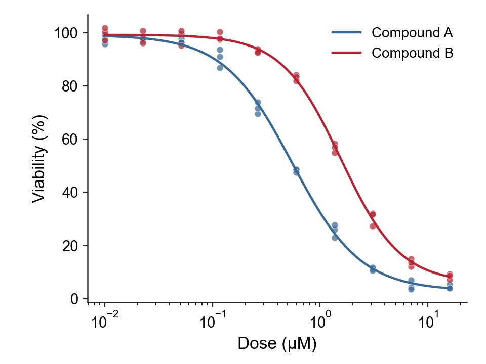
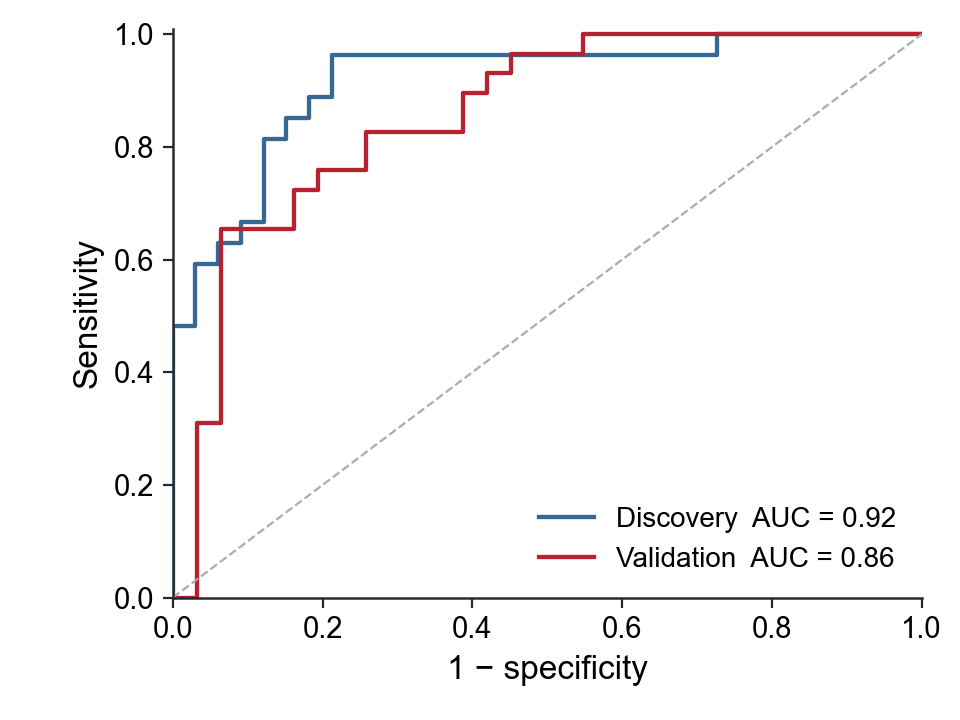
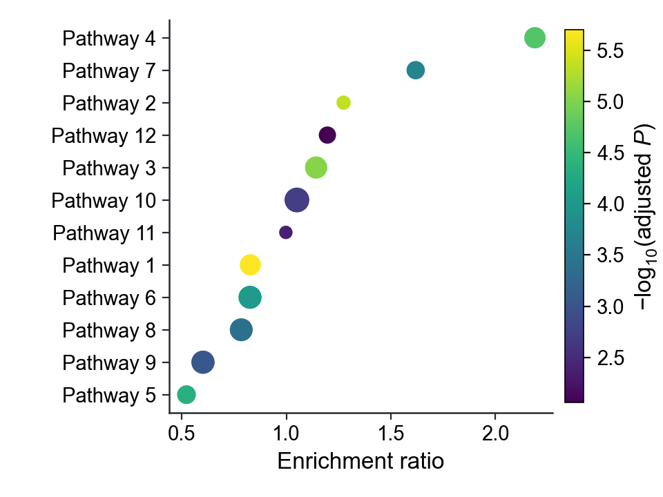
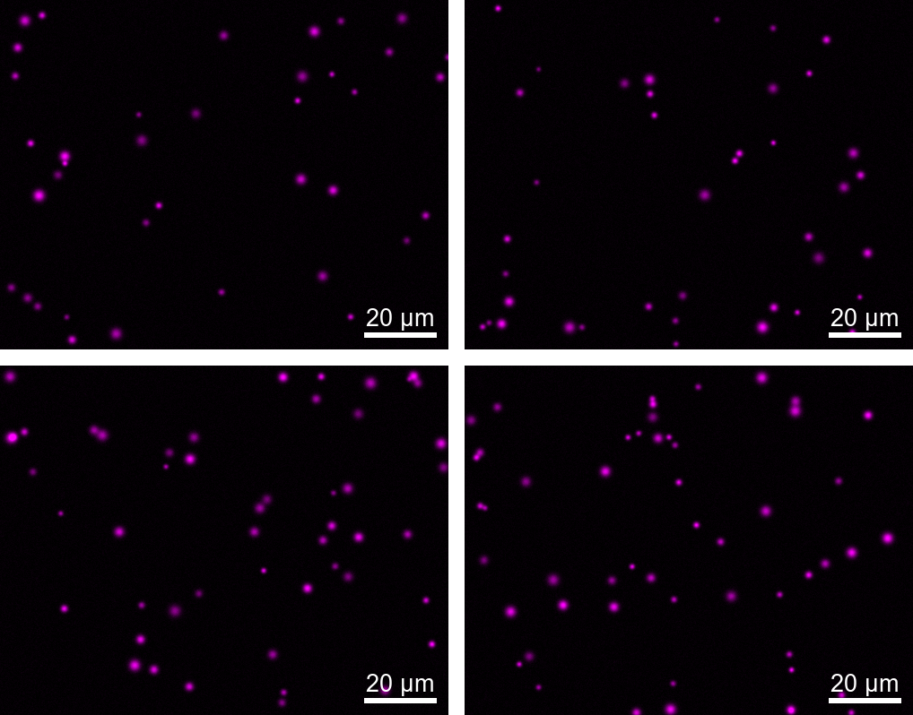

<div align="center">

<h1>SCI Figure Skills</h1>

<p><strong>Raw data → defensible statistics → editable figures → final-size QA</strong></p>

<p>Publication-grade scientific visualization for tables, microscopy, multimodal analysis, and manuscript-ready figure assembly.</p>

[](https://github.com/zhoy0409-debug/polish-sci-figures/actions/workflows/python-app.yml)
[](https://github.com/zhoy0409-debug/polish-sci-figures/releases/latest)
[](https://www.python.org/)
[](LICENSE)

<p>中文：从原始数据和科研图像出发，完成统计匹配、多款候选图、一键换色、规范标尺、固定画布、可编辑 SVG 与组图质控。</p>

</div>

---

## Start with the problem, not a chart template

- **Raw CSV/TSV/XLSX:** use `make-sci-data-figures` to identify the experimental unit, validate the design, and generate several defensible candidates.
- **Microscopy, fluorescence, histology, or EM:** use `standardize-sci-images` for non-destructive batch normalization, equal dimensions, calibrated scale bars, and an audit trail.
- **Existing figures or a final multi-panel layout:** use `polish-sci-figures` for typography, scientific notation, canvas consistency, whitespace, overlap, SVG editability, and real-size QA.

The suite does not turn every dataset into the same fashionable plot. It preserves the scientific question, biological unit, uncertainty, group order, and validation scope first; appearance comes after meaning.

## Reproducible showcase

Every showcase below is generated from deterministic synthetic data and source-controlled code. No panel titles or serial labels are baked into reusable artwork.

### Longitudinal multimodal ecosystem

Conserved cell-state flows, directional ligand–receptor interactions, RNA–ATAC concordance, and treatment-response distributions in one coordinated figure.



<details>
<summary><strong>More systems-level examples</strong></summary>

### Single-cell and spatial atlas



### Systems biology integration



### Interpretable modeling across declared cohorts



</details>

## One workflow, three focused skills

| Stage | Skill | What it delivers |
| --- | --- | --- |
| 1. Data | `make-sci-data-figures` | Structure-aware candidates, effect estimates, diagnostics, analysis record, and palette recipe |
| 2. Images | `standardize-sci-images` | Equal-size scientific images, calibrated scale bars, montage, and SHA-256 processing audit |
| 3. Finish | `polish-sci-figures` | Fixed-canvas SVG/PDF/PNG, final typography, assembly, editability checks, and container QA |

All three stages use Arial by default, allow one-place journal-font replacement, keep SVG text live, and reject unintended overlap.

## 124-template scientific atlas

The purchased 1–124 reference collection was audited in full. Every number is assigned exactly once to one of 20 scientific families; none of the source PDF or proprietary Prism files is redistributed. Useful chart ideas were retained, while decorative bars, donuts, watercolor effects, unsafe dual axes, hidden raw data, and unsupported inference were replaced with original reproducible workflows.

```bash
python skills/polish-sci-figures/scripts/template_router.py self-check
python skills/polish-sci-figures/scripts/template_router.py resolve --template 73
```

The complete mapping is machine-readable in [`template_catalog.json`](skills/polish-sci-figures/assets/template_catalog.json).

### Kaplan–Meier estimates with an aligned number-at-risk table

The display preserves censoring, risk sets, and pointwise log-log Greenwood intervals. Adjusted effects remain a declared specialist-model task.



<details>
<summary><strong>More atlas workflows</strong></summary>

### Four-parameter dose-response with raw replicates



### ROC performance in declared cohorts



### Enrichment magnitude, evidence, and count kept separate



</details>

The advanced workbench also implements forest intervals, volcano plots, confusion matrices, precision–recall curves, feature ranks, supplied embeddings, aligned alternatives to dual axes, diverging comparisons, empirical cumulative distributions, and swimmer plots. These are executable families, not a closed list of decorative presets.

## Validated scientific coverage

| Data structure | Minimal declaration | Defensible outputs |
| --- | --- | --- |
| Independent, paired, or multi-group continuous outcomes | group, value, biological-unit ID, design, order | Estimation graphics, raw points with intervals, raincloud/violin when supported, paired trajectories, group estimates |
| Numeric relationships and longitudinal responses | x/y or time/value, group, biological-unit ID | Association with uncertainty, joint distributions, individual trajectories, change from baseline |
| Compositions and tidy matrices | sample/category/value or row/column/value | 100% composition, normalized heatmap, cluster-aware heatmap, signed-magnitude dot matrix |
| Survival and dose-response | time/event/group/unit or positive dose/response/group | Kaplan–Meier with risk table; four-parameter logistic curve with residual diagnostic |
| Prediction and supplied model results | outcome/score/unit or estimate/result columns | ROC/PR, confusion matrix, forest, volcano, enrichment, feature-rank candidates |
| Embeddings, cumulative data, and event timelines | family-specific tidy coordinates or intervals | Faithful embedding views, ECDF/CCDF, swimmer timelines, safer aligned-series comparisons |
| Scientific image batches | image manifest plus calibration when scale bars are required | Locked display settings, equal dimensions, editable scale-bar layers, processing audit |

This table describes validated routes, not the limit of what the skills can draw. New chart forms are accepted when the data contract, estimand, uncertainty, and final-size QA remain explicit.

## Scientific image standardization

Microscopy, fluorescence, histology, and electron-microscopy batches keep raw pixels authoritative while sharing declared crop geometry, display settings, dimensions, and calibrated scale-bar rules. Every transformation and source hash is recorded.



## Statistics are matched to the design

| Example | Automatic behavior | Guardrail |
| --- | --- | --- |
| Control vs treatment, independent samples | Mean difference with 95% CI; Welch test; Mann–Whitney sensitivity analysis | Repeated unit IDs are rejected instead of counted as independent replication |
| Before vs after, same subjects | Paired mean difference with 95% CI; paired test; Wilcoxon sensitivity analysis | Duplicate subject-condition rows are rejected; incomplete pairs are reported |
| Binary predictions in declared cohorts | ROC and PR curves; prevalence; unit-bootstrap AUC interval | One prediction per unit; internal performance is never renamed external validation |

Exploratory and confirmatory scopes remain separate. Adjusted survival, generalized mixed, causal, spatial, high-dimensional differential, and ontology analyses require a declared specialist workflow; the skills validate and display their supplied results without inventing upstream methods.

## Install

Download the [latest release](https://github.com/zhoy0409-debug/polish-sci-figures/releases/latest) or clone the repository, then install the dependencies and copy the three skill folders.

### Windows PowerShell

```powershell
python -m pip install -r requirements.txt
New-Item -ItemType Directory -Force "$HOME\.codex\skills" | Out-Null
Copy-Item -Recurse -Force ".\skills\make-sci-data-figures" "$HOME\.codex\skills\"
Copy-Item -Recurse -Force ".\skills\standardize-sci-images" "$HOME\.codex\skills\"
Copy-Item -Recurse -Force ".\skills\polish-sci-figures" "$HOME\.codex\skills\"
```

<details>
<summary><strong>macOS / Linux</strong></summary>

```bash
python -m pip install -r requirements.txt
mkdir -p ~/.codex/skills
cp -R skills/make-sci-data-figures ~/.codex/skills/
cp -R skills/standardize-sci-images ~/.codex/skills/
cp -R skills/polish-sci-figures ~/.codex/skills/
```

</details>

Start a new Codex session after installation.

## Call the skills

```text
Use $make-sci-data-figures to profile this table and generate several publication-ready candidates.
Use $make-sci-data-figures to rerender the selected figure with the okabe_ito palette only.
Use $standardize-sci-images to standardize this microscopy batch and add calibrated 20 µm scale bars.
Use $polish-sci-figures to assemble the selected panels and audit the final editable SVGs.
```

## Reproduce and verify

```bash
# Rebuild deterministic showcase data and figures
python skills/make-sci-data-figures/examples/make_advanced_examples.py
python demo/figure_sources/make_demo_suite.py

# Run repository checks
python skills/make-sci-data-figures/scripts/test_figure_workbench.py
python skills/make-sci-data-figures/scripts/test_data_family_workbench.py
python skills/make-sci-data-figures/scripts/test_advanced_template_workbench.py
python skills/standardize-sci-images/scripts/test_standardize_images.py
python skills/polish-sci-figures/scripts/template_router.py self-check
```

Each generated data-figure bundle contains fixed-canvas PNG/SVG/PDF candidates, a same-size gallery, `data_profile.json`, `analysis_plan.json`, and `figure_recipe.json`. Palette-only rerendering preserves filtering, statistics, ordering, labels, geometry, and canvas.

## Release gates

- No unrequested panel letters, serial numbers, internal titles, or subtitles.
- No hidden biological-unit duplication, invented statistics, labels, clusters, or validation claims.
- No text–text, text–data, legend, scale-bar, axis, or annotation collisions at final size.
- Equal physical canvas and axes geometry for panels intended for the same slot.
- Correct case, italics, units, symbols, subscripts, superscripts, and journal font.
- Editable SVG/PDF plus high-resolution PNG; raster content is never mislabeled fully editable.

## Repository layout

```text
skills/make-sci-data-figures/   raw data, statistics, candidate charts, palette recipes
skills/standardize-sci-images/  calibrated image standardization and processing audit
skills/polish-sci-figures/      final drawing, assembly, export, and QA
demo/                           deterministic synthetic previews and sources
```

## License

MIT License. See [LICENSE](LICENSE).
