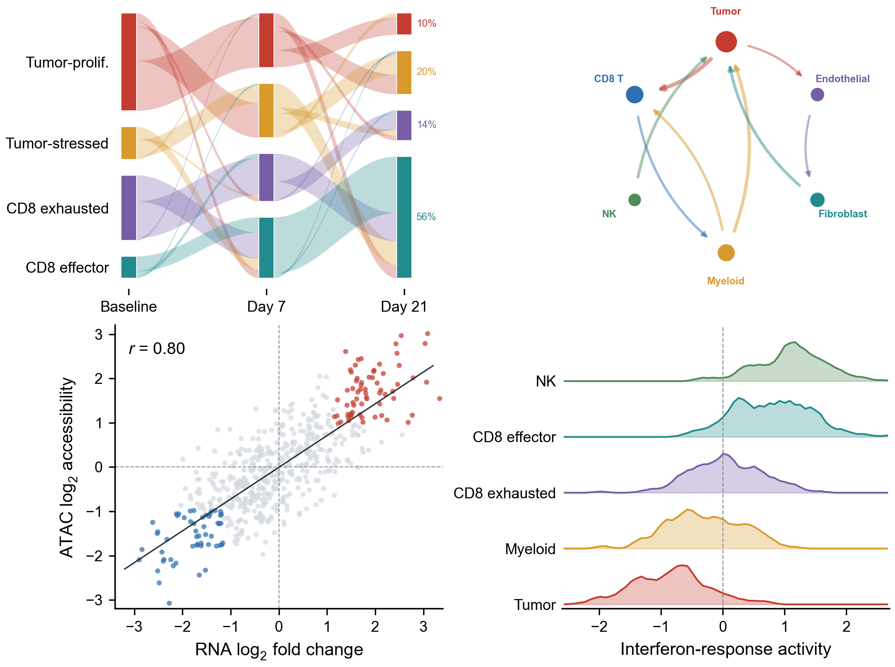
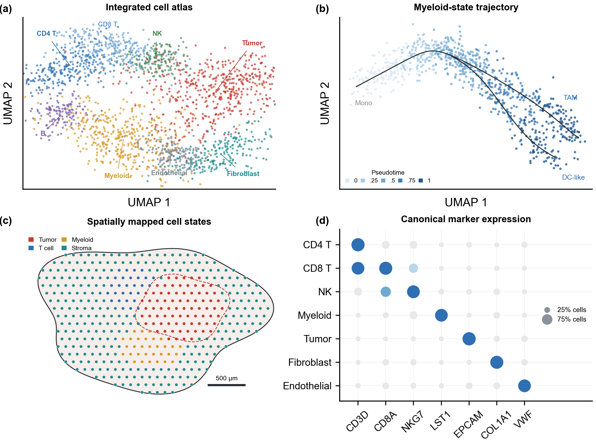
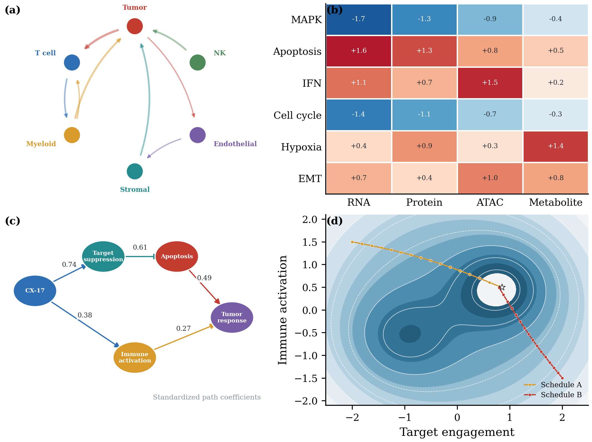
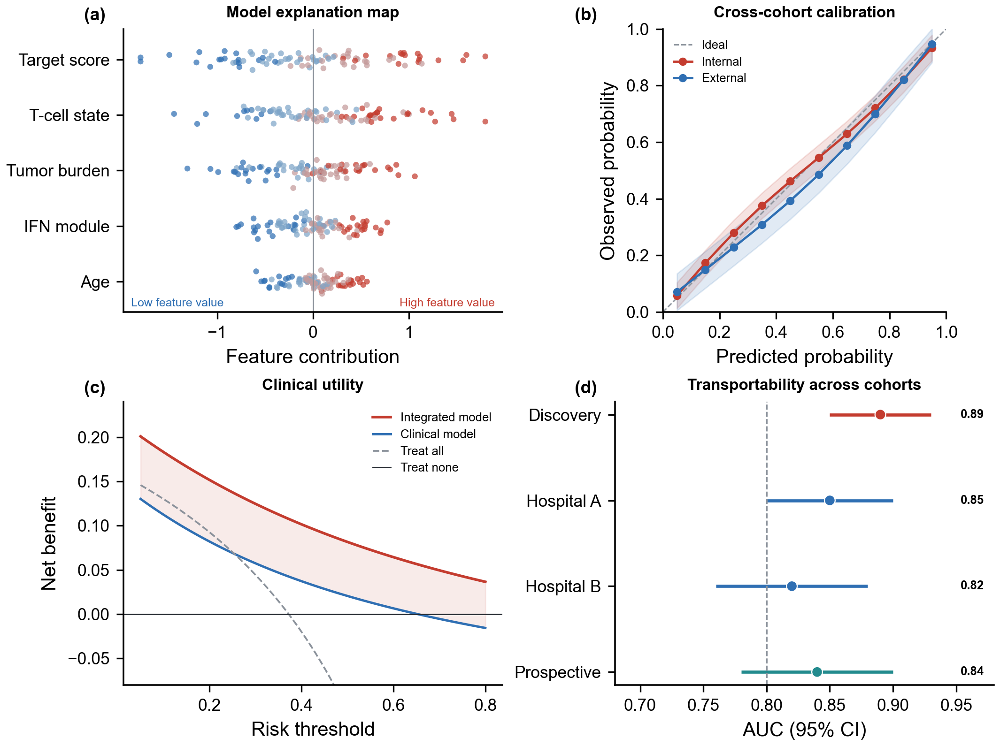
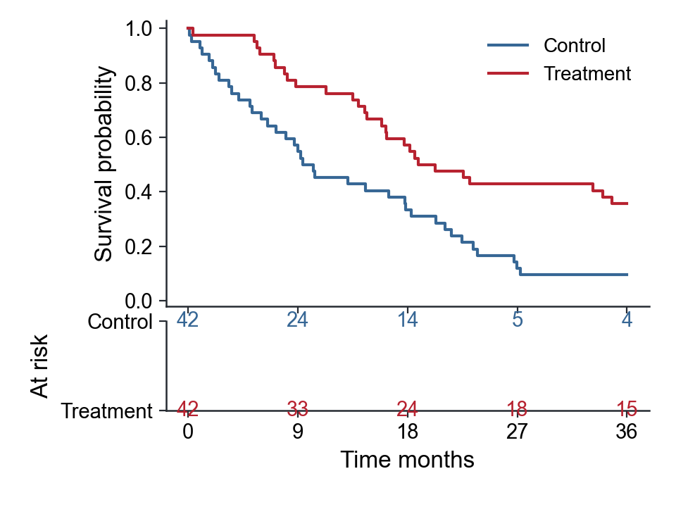
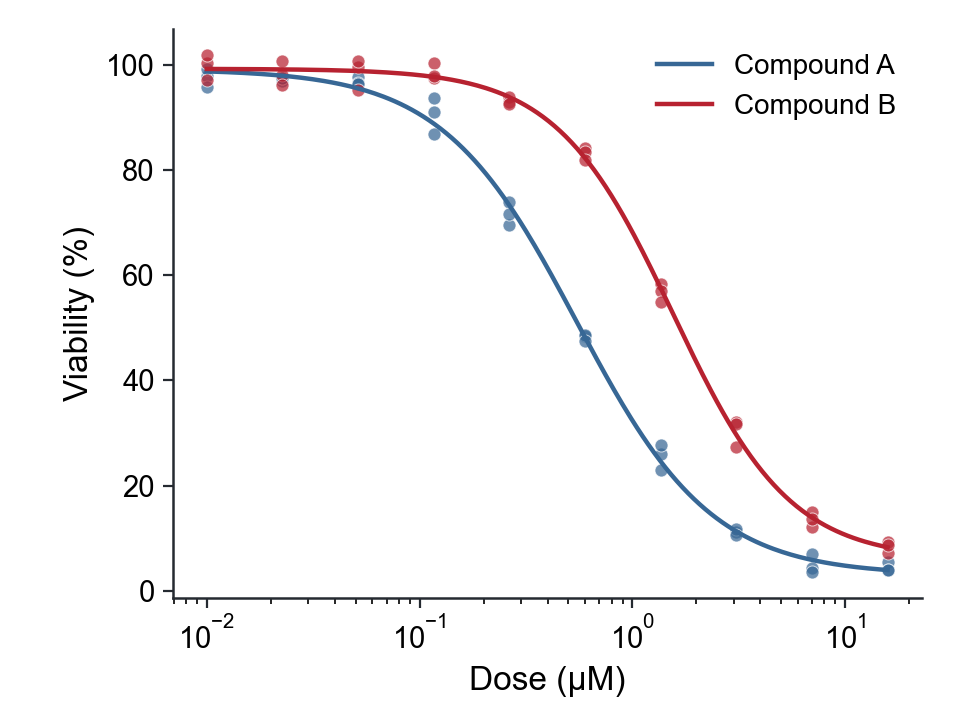
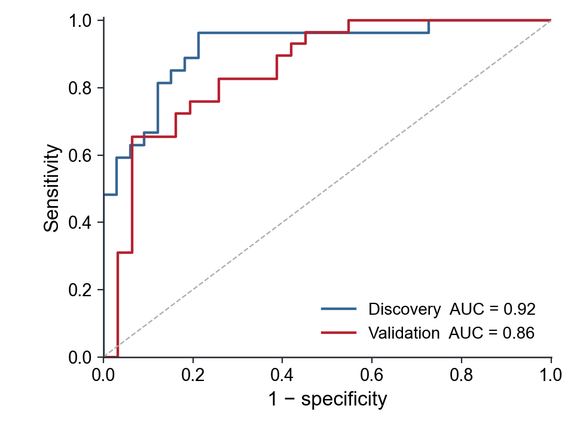
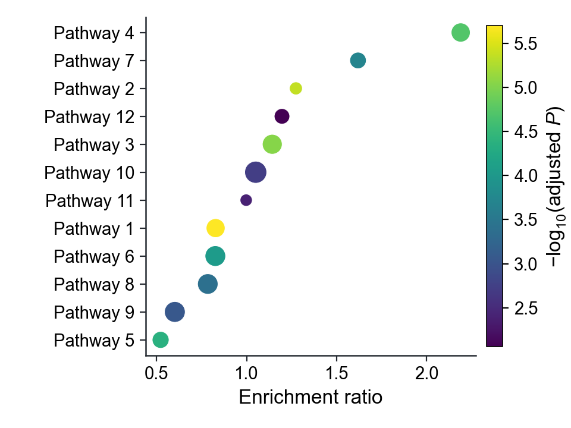
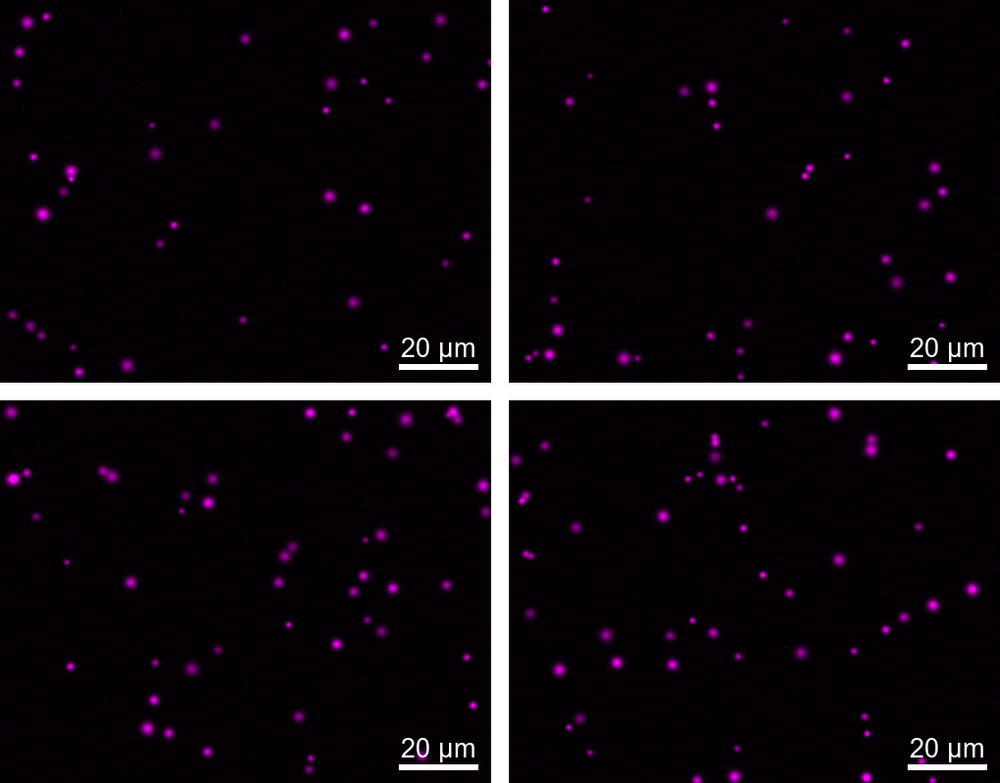

<div align="center">

<h1>SCI Figure Skills</h1>

<p><strong>Raw data → defensible statistics → editable figures → final-size QA</strong></p>

<p>Publication-grade scientific visualization for tables, microscopy, multimodal analysis, and manuscript-ready figure assembly.</p>

[](https://github.com/zhoy0409-debug/polish-sci-figures/actions/workflows/python-app.yml)
[](https://github.com/zhoy0409-debug/polish-sci-figures/releases/latest)
[](https://www.python.org/)
[](LICENSE)

<p>中文：从原始数据和科研图像出发，完成统计匹配、多款候选图、一键换色、规范标尺、固定画布、可编辑 SVG 与组图质控。</p>

</div>

---

## Choose your entry

### I have raw CSV or Excel data

Start with `make-sci-data-figures` or the unified inspector:

```bash
python sci_figures.py inspect data.csv
python sci_figures.py route data.csv
```

### I have microscopy, fluorescence, pathology, or EM images

Start with `standardize-sci-images` and a manifest. Scale bars require authoritative calibration.

```bash
python skills/standardize-sci-images/scripts/standardize_images.py manifest.csv --outdir standardized --scale-bar-um 20
```

### I already have a Figure/SVG and need final QA

Start with `polish-sci-figures` or the unified QA command:

```bash
python sci_figures.py qa figure.svg
```

## Start with the problem, not a chart template

- **Raw CSV/TSV/XLSX:** use `make-sci-data-figures` to identify the experimental unit, validate the design, and generate several defensible candidates.
- **Microscopy, fluorescence, histology, or EM:** use `standardize-sci-images` for non-destructive batch normalization, equal dimensions, calibrated scale bars, and an audit trail.
- **Existing figures or a final multi-panel layout:** use `polish-sci-figures` for typography, scientific notation, canvas consistency, whitespace, overlap, SVG editability, and real-size QA.

The suite does not turn every dataset into the same fashionable plot. It preserves the scientific question, biological unit, uncertainty, group order, and validation scope first; appearance comes after meaning.

## Reproducible showcase

Every showcase below is generated from deterministic synthetic data and source-controlled code. No panel titles or serial labels are baked into reusable artwork.

### Longitudinal multimodal ecosystem

Conserved cell-state flows, directional ligand–receptor interactions, RNA–ATAC concordance, and treatment-response distributions in one coordinated figure.



<details>
<summary><strong>More systems-level examples</strong></summary>

### Single-cell and spatial atlas



### Systems biology integration



### Interpretable modeling across declared cohorts



</details>

## One workflow, three focused skills

| Stage | Skill | What it delivers |
| --- | --- | --- |
| 1. Data | `make-sci-data-figures` | Structure-aware candidates, effect estimates, diagnostics, analysis record, and palette recipe |
| 2. Images | `standardize-sci-images` | Equal-size scientific images, calibrated scale bars, montage, and SHA-256 processing audit |
| 3. Finish | `polish-sci-figures` | Fixed-canvas SVG/PDF/PNG, final typography, assembly, editability checks, and container QA |

All three stages use Arial by default, allow one-place journal-font replacement, keep SVG text live, and reject unintended overlap. Since v1.3.0 the requested font must be installed; fallback is a draft-only opt-in and is recorded as not approved for final delivery.

## 124-template scientific atlas

The purchased 1–124 reference collection was audited in full. Every number is assigned exactly once to one of 20 scientific families; none of the source PDF or proprietary Prism files is redistributed. Useful chart ideas were retained, while decorative bars, donuts, watercolor effects, unsafe dual axes, hidden raw data, and unsupported inference were replaced with original reproducible workflows.

```bash
python skills/polish-sci-figures/scripts/template_router.py self-check
python skills/polish-sci-figures/scripts/template_router.py resolve --template 73
```

The complete mapping is machine-readable in [`template_catalog.json`](skills/polish-sci-figures/assets/template_catalog.json).

### Kaplan–Meier estimates with an aligned number-at-risk table

The display preserves censoring, risk sets, and pointwise log-log Greenwood intervals. Adjusted effects remain a declared specialist-model task.



<details>
<summary><strong>More atlas workflows</strong></summary>

### Four-parameter dose-response with raw replicates



### ROC performance in declared cohorts



### Enrichment magnitude, evidence, and count kept separate



</details>

The advanced workbench also implements forest intervals, volcano plots, confusion matrices, precision–recall curves, feature ranks, supplied embeddings, aligned alternatives to dual axes, diverging comparisons, empirical cumulative distributions, and swimmer plots. These are executable families, not a closed list of decorative presets.

## Validated scientific coverage

| Data structure | Minimal declaration | Defensible outputs |
| --- | --- | --- |
| Independent, paired, or multi-group continuous outcomes | group, value, biological-unit ID, design, order | Estimation graphics, raw points with intervals, raincloud/violin when supported, paired trajectories, group estimates |
| Numeric relationships and longitudinal responses | x/y or time/value, group, biological-unit ID | Association with uncertainty, joint distributions, individual trajectories, change from baseline |
| Compositions and tidy matrices | sample/category/value or row/column/value | 100% composition, normalized heatmap, cluster-aware heatmap, signed-magnitude dot matrix |
| Survival and dose-response | time/event/group/unit or positive dose/response/group | Kaplan–Meier with risk table; four-parameter logistic curve with residual diagnostic |
| Prediction and supplied model results | outcome/score/unit/positive class or estimate/result columns | ROC/PR, confusion matrix, forest, volcano, enrichment, feature-rank candidates |
| Embeddings, cumulative data, and event timelines | family-specific tidy coordinates or intervals | Faithful embedding views, ECDF/CCDF, swimmer timelines, safer aligned-series comparisons |
| Scientific image batches | image manifest plus calibration when scale bars are required | Locked display settings, equal dimensions, editable scale-bar layers, processing audit |

This table describes validated routes, not the limit of what the skills can draw. New chart forms are accepted when the data contract, estimand, uncertainty, and final-size QA remain explicit.

## Scientific image standardization

Microscopy, fluorescence, histology, and electron-microscopy batches keep raw pixels authoritative while sharing declared crop geometry, display settings, dimensions, and calibrated scale-bar rules. Every transformation and source hash is recorded.



## Statistics are matched to the design

| Example | Automatic behavior | Guardrail |
| --- | --- | --- |
| Control vs treatment, independent samples | Mean difference with 95% CI; Welch test; Mann–Whitney sensitivity analysis | Repeated unit IDs are rejected instead of counted as independent replication |
| Before vs after, same subjects | Paired mean difference with 95% CI; paired test; Wilcoxon sensitivity analysis | Duplicate subject-condition rows are rejected; incomplete pairs are reported |
| Binary predictions in declared cohorts | ROC and PR curves; prevalence; unit-bootstrap AUC interval | One prediction per unit; internal performance is never renamed external validation |

Exploratory and confirmatory scopes remain separate. Adjusted survival, generalized mixed, causal, spatial, high-dimensional differential, and ontology analyses require a declared specialist workflow; the skills validate and display their supplied results without inventing upstream methods.

## Install

Download the complete `sci-figure-suite-v1.3.3.zip` from the [latest release](https://github.com/zhoy0409-debug/polish-sci-figures/releases/latest), or clone the repository. The suite archive includes the unified CLI, dependency files, README, LICENSE, citation metadata, and all three installable Skill folders.

OpenAI's current Skills documentation says Skills are supported in Codex and the API, and that Plugins package Skills for broader workflows across ChatGPT and Codex. Checked: 2026-08-25.

Use `$HOME/.agents/skills` as the primary local install path. Some older Codex builds may still read `$HOME/.codex/skills`; that path is kept only as a legacy compatibility note.

### Windows PowerShell

```powershell
python -m pip install -r requirements.txt
New-Item -ItemType Directory -Force "$HOME\.agents\skills" | Out-Null
Copy-Item -Recurse -Force ".\skills\make-sci-data-figures" "$HOME\.agents\skills\"
Copy-Item -Recurse -Force ".\skills\standardize-sci-images" "$HOME\.agents\skills\"
Copy-Item -Recurse -Force ".\skills\polish-sci-figures" "$HOME\.agents\skills\"
```

<details>
<summary><strong>macOS / Linux</strong></summary>

```bash
python -m pip install -r requirements.txt
mkdir -p "$HOME/.agents/skills"
cp -R skills/make-sci-data-figures "$HOME/.agents/skills/"
cp -R skills/standardize-sci-images "$HOME/.agents/skills/"
cp -R skills/polish-sci-figures "$HOME/.agents/skills/"
```

</details>

Legacy Codex compatibility, only if your local build documents it:

```bash
mkdir -p "$HOME/.codex/skills"
cp -R skills/make-sci-data-figures "$HOME/.codex/skills/"
cp -R skills/standardize-sci-images "$HOME/.codex/skills/"
cp -R skills/polish-sci-figures "$HOME/.codex/skills/"
```

For ChatGPT Web, ChatGPT Work, or wider workspace distribution, package these Skills as a Plugin in a future release. This repository does not claim that a Plugin has already been published.

If a newly installed or updated Skill is not yet visible, refresh or reopen the Skills page.

## Call the skills

```text
Use $make-sci-data-figures to profile this table and generate several publication-ready candidates.
Use $make-sci-data-figures to rerender the selected figure with the okabe_ito palette only.
Use $standardize-sci-images to standardize this microscopy batch and add calibrated 20 µm scale bars.
Use $polish-sci-figures to assemble the selected panels and audit the final editable SVGs.
```

## Unified CLI

```bash
python sci_figures.py doctor --font Arial
python sci_figures.py doctor --font Arial --json
python sci_figures.py inspect data.xlsx --sheet 0 --json
python sci_figures.py route data.xlsx --structure group-comparison --design paired
python sci_figures.py qa figure.svg --font Arial --json
```

Use `--help` on any subcommand. `doctor` reports dependencies, writable Matplotlib cache, fonts, renderers, platform, and Skill structure. `inspect` uses exact token and multi-token aliases plus dtype, missingness, cardinality, and repetition to provide evidence-backed candidates. `route` never runs inferred statistics and never defaults to an independent design. It withholds the command until structure and required fields are unambiguous, declared columns exist, roles do not conflict, route-specific type/value checks pass, and the declared design is compatible with the downstream workbench. Survival requires explicit numeric 0/1 events, while ROC/PR requires `--positive` for nonstandard class labels. Statuses are `CONFIRMED`, `SUGGESTION`, `NEEDS_CONFIRMATION`, `MANUAL_REVIEW`, `WARN`, and blocking `FAIL`/`UNSAFE`.

`doctor --json` and `qa --json` write JSON only. Blocking findings exit 2; warnings and manual-review items exit 0. SVG automation checks parse canvas-related metadata, live/fragmented text, font-family declarations, raster resources and effective DPI, plus basic contrast/grayscale signals. Collision, final-size legibility, scientific notation, sub/superscripts, and color-only meaning remain explicit `MANUAL_REVIEW` tasks. Raster DPI requires `--width-mm`; metadata alone is not accepted as final-size proof. PDF embedding uses only the `pdffonts` `emb` column; when the tool is missing, QA requires manual review.

## Shortest Successful Path

```bash
python sci_figures.py doctor --font "DejaVu Sans"
python sci_figures.py inspect skills/make-sci-data-figures/examples/synthetic_group_comparison.csv
python skills/make-sci-data-figures/scripts/figure_workbench.py generate \
  skills/make-sci-data-figures/examples/synthetic_group_comparison.csv \
  --group condition --value Response --unit sample_id \
  --design independent --order Control,Treatment \
  --outcome-type continuous --font "DejaVu Sans" --outdir demo_run
python sci_figures.py qa demo_run/raw_points_estimate_ci.svg
```

Use Arial or a journal-required font for final submission files. `DejaVu Sans` is used above only because it is bundled with Matplotlib and works on CI systems that do not install Arial.

## Complete Reproducible Example

```bash
python skills/make-sci-data-figures/examples/make_family_examples.py
python skills/make-sci-data-figures/scripts/data_family_workbench.py relationship \
  skills/make-sci-data-figures/examples/synthetic_relationship.csv \
  --x exposure --y response --unit unit --group cohort \
  --font "DejaVu Sans" --outdir relationship_results
python sci_figures.py qa relationship_results/relationship_regression.svg
```

Chinese prompt example:

```text
Use $make-sci-data-figures 先检查这个 CSV 的实验单位、分组和值列，再生成候选 SCI 图并保留分析记录。
```

English prompt example:

```text
Use $polish-sci-figures to audit this SVG for canvas consistency, live text, font fallback, accessibility, and final delivery readiness.
```

## Common Failures

| Message | Meaning | Fix |
| --- | --- | --- |
| `Required font 'Arial' is not installed` | The target font is missing and fallback is blocked | Install the font, choose an installed final font, or use `--allow-font-fallback` only for drafts |
| `Legacy .xls is not a tested v1.3.3 input` | Old Excel format is outside the tested core path | Convert to `.xlsx`, CSV, or TSV |
| `A scale bar requires an authoritative um_per_pixel column` | Calibration is missing | Add calibration from acquisition metadata or records |
| `Independent data contain repeated experimental-unit IDs` | Possible pseudoreplication | Declare paired/repeated/nested design or aggregate technical replicates explicitly |
| `SVG contains embedded raster layer(s)` | The SVG is partially editable | Do not describe it as fully vector editable |

## Data Privacy And Local Processing

The command-line scripts process local files on the machine where you run them. They do not intentionally upload data. Codex, ChatGPT, GitHub Actions, or any future Plugin surface may have separate data-handling behavior; review that environment before using sensitive patient, genomic, unpublished, or proprietary research data.

## Version Compatibility

| Component | v1.3.3 tested range |
| --- | --- |
| Python | 3.10-3.12 |
| OS CI matrix | Ubuntu, Windows, macOS |
| Tables | CSV, TSV, XLSX |
| Legacy `.xls` | Not supported; convert first |
| Core dependencies | See `requirements.txt` |
| Optional integrations | See `requirements-optional.txt` |

Python 3.10 and 3.12 are tested as compatibility endpoints on every supported OS; 3.11 lies inside that supported interval. The endpoint strategy limits CI cost while testing both ends of the declared range.

## Skill behavior evaluation

- Schema validation checks the eval case contract in `evals/skill_behavior_v1_3_3.json`.
- Replay evaluation supports required-all/any, forbidden rules, regular expressions, and explicit synonym groups while retaining raw output and match evidence.
- Live Codex capture is not bundled in this hotfix. It must be reported as `live_eval_run: false` unless a separately verified official runner captured real outputs; replay fixtures are not live-model evidence.

## Reproduce and verify

```bash
# Rebuild deterministic showcase data and figures
python skills/make-sci-data-figures/examples/make_advanced_examples.py
python demo/figure_sources/make_demo_suite.py

# Run repository checks
python skills/make-sci-data-figures/scripts/test_figure_workbench.py
python skills/make-sci-data-figures/scripts/test_data_family_workbench.py
python skills/make-sci-data-figures/scripts/test_advanced_template_workbench.py
python skills/standardize-sci-images/scripts/test_standardize_images.py
python skills/polish-sci-figures/scripts/template_router.py self-check
```

Each generated data-figure bundle contains fixed-canvas PNG/SVG/PDF candidates, a same-size gallery, `data_profile.json`, `analysis_plan.json`, and `figure_recipe.json`. Palette-only rerendering preserves filtering, statistics, ordering, labels, geometry, and canvas.

## Release gates

- No unrequested panel letters, serial numbers, internal titles, or subtitles.
- No hidden biological-unit duplication, invented statistics, labels, clusters, or validation claims.
- No text–text, text–data, legend, scale-bar, axis, or annotation collisions at final size.
- Equal physical canvas and axes geometry for panels intended for the same slot.
- Correct case, italics, units, symbols, subscripts, superscripts, and journal font.
- Editable SVG/PDF plus high-resolution PNG; raster content is never mislabeled fully editable.

## Acknowledgments

Thanks to Gliese-876 for proposing the private-runtime dependency and source-portability QA that was integrated in PR #1. v1.3.1 preserves that contribution and extends its regression coverage.

## Repository layout

```text
skills/make-sci-data-figures/   raw data, statistics, candidate charts, palette recipes
skills/standardize-sci-images/  calibrated image standardization and processing audit
skills/polish-sci-figures/      final drawing, assembly, export, and QA
demo/                           deterministic synthetic previews and sources
```

## License

MIT License. See [LICENSE](LICENSE).
